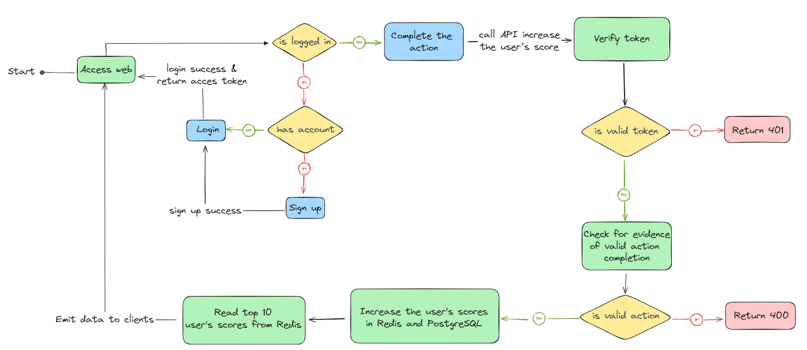
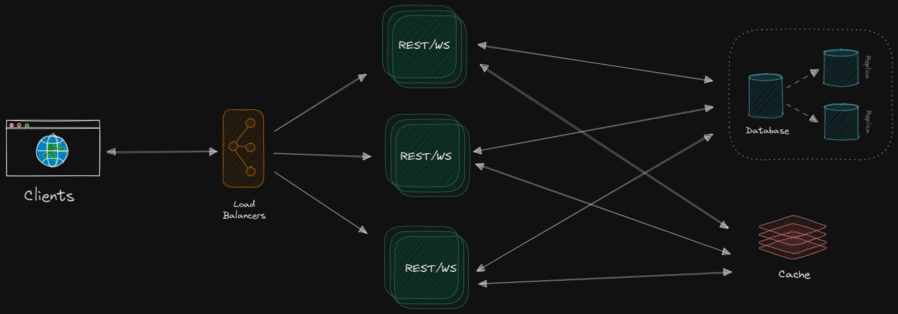

# 99Tech Code Challenge

## Problem 6

### The flow diagram

- **Blue blocks**: represents user interactions with the software
- **Yellow blocks**: condition blocks, each block has 2 condition check result lines, a red line when the condition is wrong and a green line when the electrical condition is correct
- **Pink blocks**: reject and return the corresponding response for each case
- **Green blocks**: implement application logic:
    - Implement an authentication and authorization strategy (JWT, OAuth2, SSO..), security strategy (rate limit, IP blacklist...)
    - Check for evidence of valid action completion
    - Increase the user's scores in Redis and PostgreSQL
    - Read top 10 user's scores from Redis or PostgreSQL (if cache miss)

### The architecture example

- This is the sample architecture I gave with the current simple requirements:

  - **Load Balancer** to efficiently distributing incoming network traffic across a group of backend servers (WS service and REST service). Use HAProxy, Traefik... to implement it.
  - **REST/WS** is a monolith services that receive and process requests.It is a ExpressJS socket.io server that holds connections and updates realtime data for connected clients and receives and responds to HTTP requests. If running multiple instances as shown, deploy an adapter and emitter to broadcast events to all or a subset of clients and allow communication to the group of Socket.IO servers
  - **Redis** and **PostgreSQL** to use store data. Consider using replication for PostgreSQL and Sentinel for Redis to handle failover, separating read/write data streams.

- Scale:
  - Break down REST/WS into services: REST Gateway, WS Gateway, Auth, User, Score...
  - Use SocketCluster
  - Use Kafka, RabbitMQ to distribute events/messages between services.
